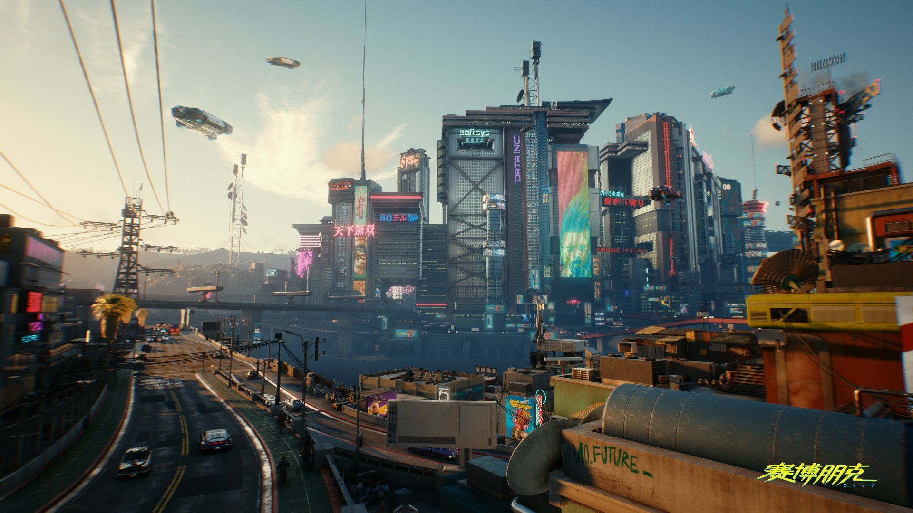
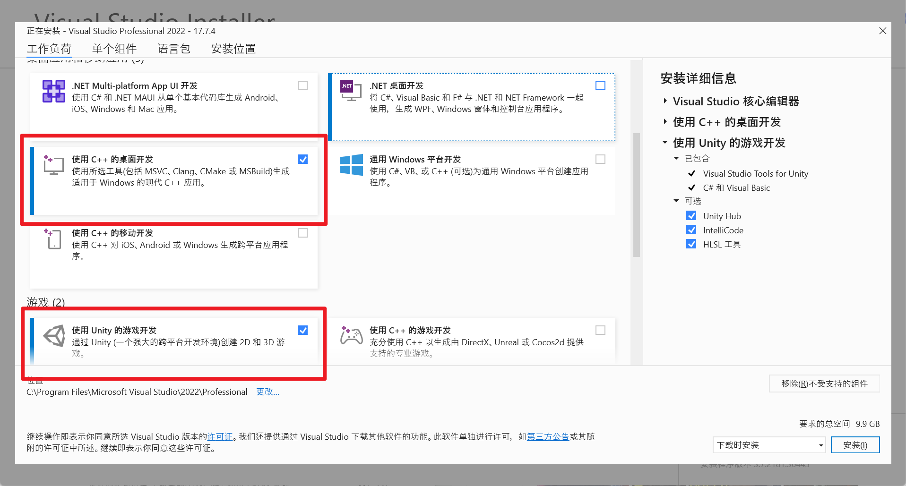
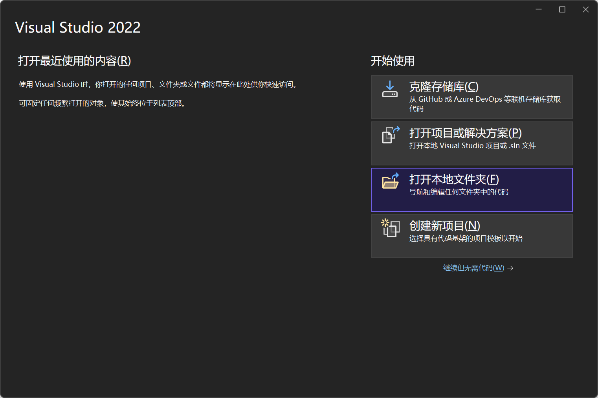
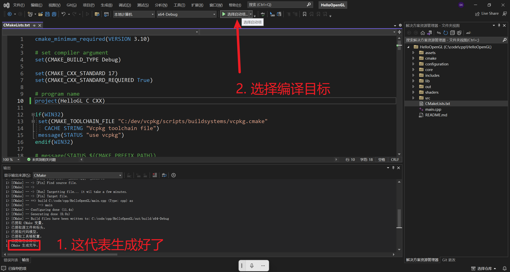
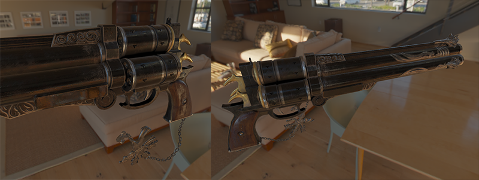
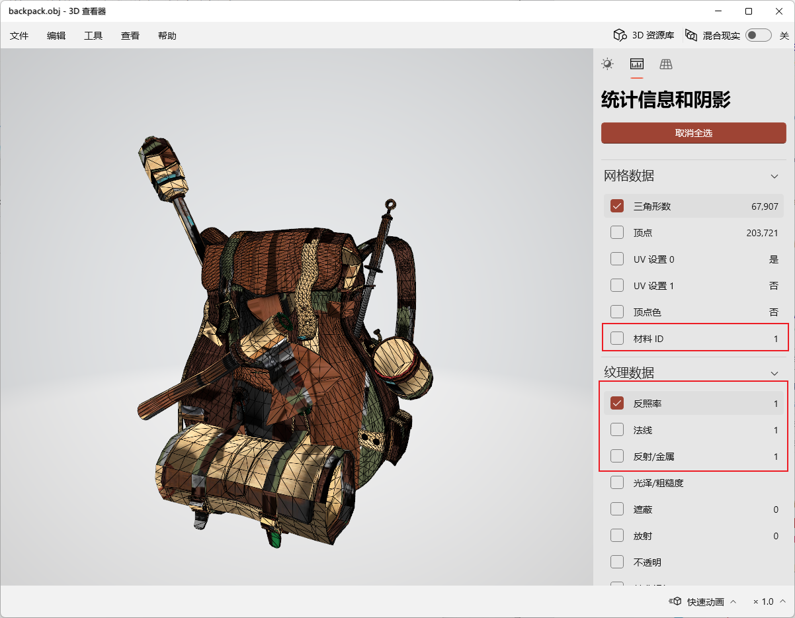
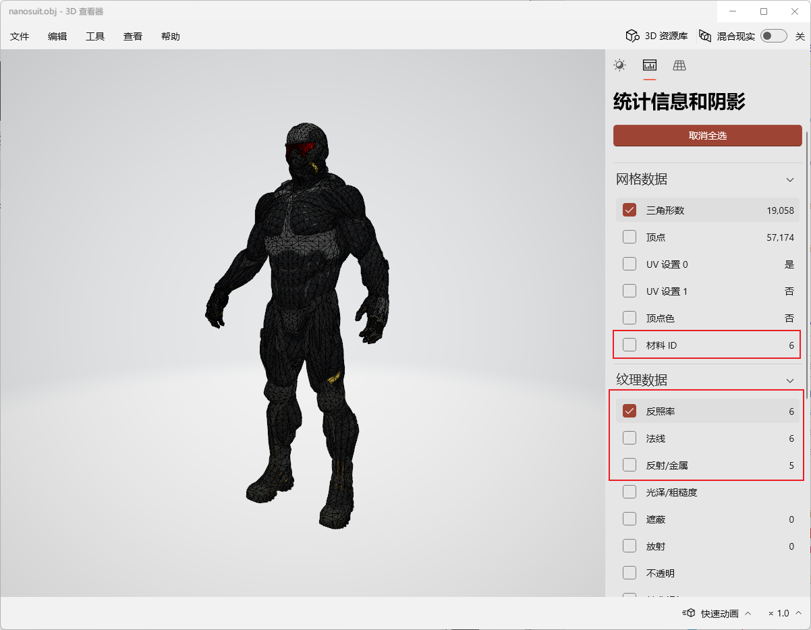
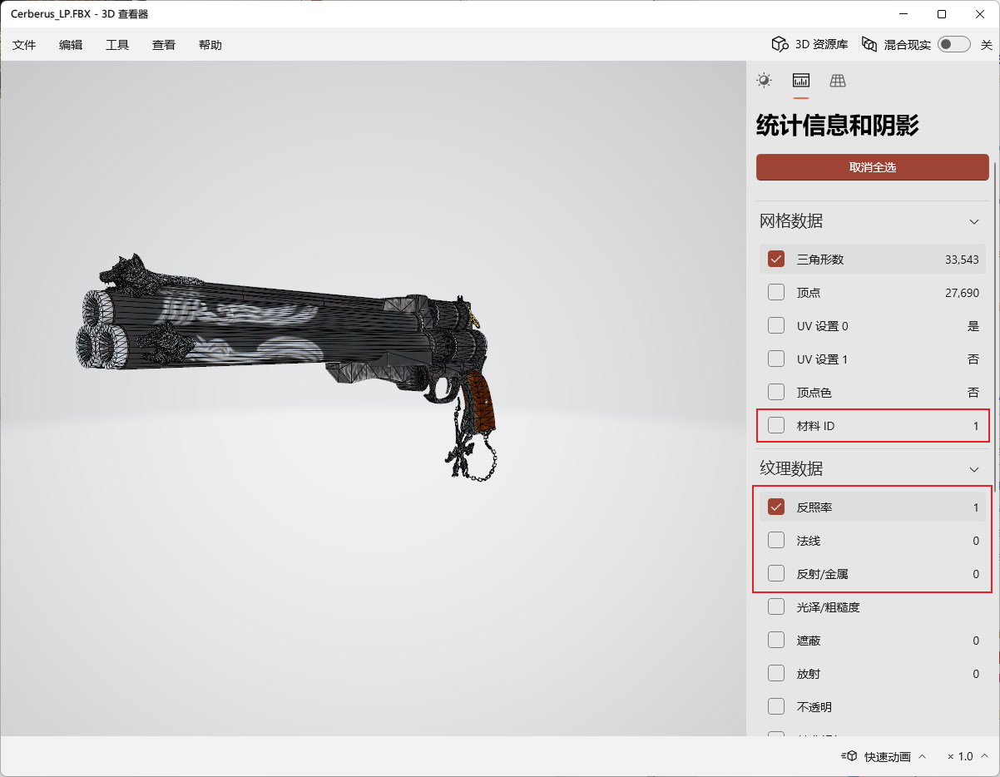
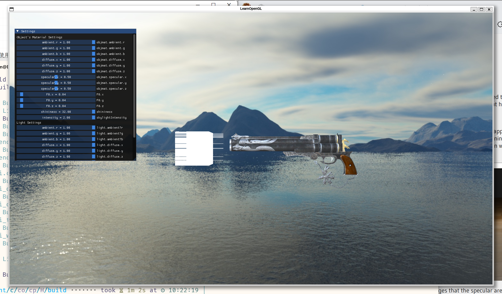

# Hello OpenGL!

> 本次实验了助教本科时写的轮子库[dySim](https://github.com/DyllanElliia/dySim)的部分代码，主要使用了 GUI 和图形管线模块。
>
> > dySim 是一个涉及 数学、渲染、仿真 的图形玩具框架！是玩具！
>
> 若你想了解图形绘制的API，请看 [LearnOpenGL](https://learnopengl.com/)！
>
> 若你想开发项目，请用隔壁[Vulkan](https://www.vulkan.org/learn)的API！
>
> 若你只是需要三维可视化or渲染，请用Github上别人写好的轮子，例如[Easy3D](https://github.com/LiangliangNan/Easy3D)、[nori](https://github.com/wjakob/nori)等！
>
> 若你需要包含渲染、仿真、几何处理且操作简单的完整**开源**图形学工具，请用[Blender](https://github.com/blender/blender)！

> **关于提交**：提交打包的代码，请务必不要打包**任何**文件夹。
>
> **DDL**：11月15日
>
> 除了报告，你还要给我这几个**源码文件**：
>
> - `main.cpp`
> - `shader/model_render.fs`
> - `shader/model_render.vs`
> - `yourQuat.hpp`
> - `其它你觉得必要的文件`

## Introduction



图形学为现代影视业、游戏业、军工、医学图像等几乎所有行业带来了不可思议的视觉效果，这是让计算机脱离命令行，走入广大一般用户的一个不可思议的领域！

图形学不止渲染，它是由 **渲染**、几何、**仿真** 和 **可视化** 构成的一个庞大交叉领域。而图形学研究者们的终极目标必然是使用计算机仿真真实世界！不过这依旧有很长一段路要走。

> 若你想了解图形学最前沿的研究在做什么，可以来看看这位老哥的[SIGGRAPH论文收集库](https://kesen.realtimerendering.com/)。

关于为什么选择 OpenGL 作为实验框架轮子，因为它的网上公开资料多。若你想深入学习 gpu 渲染管线，从 Opengl 作为入门是个不错的选择（还有什么可进阶学的框架？Vulkan 和 DX11！***Vulkan is all you need!*** ）

当然，学习api是无止境的，api 把程序员变成了脱离百度（bing and google）就无法独立生活的寄居生物。为了解放大家于无尽的 api 查找，实验选择了助教在几年前封装的几个图形管线工具。

- 若你只打算完成基础的checkpoint，那么你将无需依赖 api 搜索；
- 若你打算上手简单的 ex point，我会尽可能提供一些资料，并提供一点点轮子帮助，但你需要稍微深入看一下api部分（因为这是扩展内容，我就不花笔墨在这上面啦）；
- 若你打算上手最难的 ex point，不幸的是，我只能提供资料，你需要了解 api，甚至深入到其他领域的学习中（这些都是助教过去写过的，尽管记忆模糊了，但助教可以保证实现的可行性）

为了照顾最多数系统，本次实验基于 Cmake 组织代码架构。为了照顾 win 用户，助教在下面提供一个完整的vs+vcpkg+cmake 的食用指南。对于 Linux/Mac 用户，你们有自己的库管理工具，例如 Ubuntu 的 apt、mac 的 homebrew 和 Arch 的 pacman，环境配置难度显然低于 win 玩家，所以就不提供资料了（`mkdir build`那套组合拳即可）。

> 两点值得关注的：
>
> 1. 助教只有win和arch两个系统，因此只能保证这个cmake项目能在这两个平台上跑！若你是ubuntu、mac等其他用户，助教无法提供完整的帮助。
> 2. 不同系统下的包管理的库名不同，可能导致cmake找不到你的库，例如 GLFW在pacman下是GLFW3、而在vcpkg下是glfw，所以build出问题时优先检查库名！


**关于 Opengl**：这不是一个没有任何发展的库，尽管我们说它是老东西了，但它为了适应新时代，它真的很努力地进化出了 GLFW3+GLAD 等库（以及对应的数学库 GLM）。**老师上课讲的是 GLU+GLUT 库**，也就是大家口中的老东西，它的最后一次更新是1998年8月，且它的许可证不允许任何人进行修改，因此别在项目和工程里用，且它的性能和编程舒适度低到汗颜。除外，它和现代的 GLFW **近乎完全不兼容**。由于**GLFW 支持 GLSL语言**作为Shader，图形开发者就彻底抛弃了使用glMatrixMode指定投影的方式，本次实验我们将浅浅看一下怎么用数学库GLM计算这些矩阵，然后传入shader，并在vertex shader中实现投影。实验目标：

1. 了解一个图形程序的**渲染部分**的大致框架；
2. 温故线性代数，体验基于线性空间的变换便利，并上手一些 GLM；
3. 感受一下怎么写一个渲染器，浅浅了解下基础渲染理论（附加资料提供：现代物理渲染理论）

**关于四元数**：四元数是复数的高维扩展，它继承了复数（复变函数）具备的多种特性，e.g. 保角性、旋转不变性等等，而旋转这个特性则是我们这次实验要着重关注的。几乎所有数学库都包含四元数，而实验使用的 GLM 数学库也不例外。因此，本次实验分下面几步：

1. 上手使用 GLM 四元数构造旋转矩阵；
2. 给定一个数学推导材料，按照里面的描述实现一个简单的四元数类（通过对比 GLM 来验证你的实现对不对）
3. 回过头，阐述一下我提供的两种 GLM 四元数构造为什么是等价的（在报告中阐述）

> 有其他问题可私信助教

## Win 环境配置食用指南

首先，别用网上很多 win 用户使用的那个 cmake gui 工具，因为它构建 sln 时很大概率听不懂你 cmakelist 里写的东西。而 vs 本身提供了 cmake 支持，所以**只需要 vs 就够了**。

### 下载vs

你只需要装这两个模块，第一个是本次实验用的，第二个是HOLOLENs实验用的。



### 下载 vcpkg + 安装实验库

> 首先，准备好你的梯子和 [Git](https://git-scm.com/book/zh/v2/%E8%B5%B7%E6%AD%A5-%E5%AE%89%E8%A3%85-Git)（注：git 有个 GUI 工具叫 github desktop，这也是个好东西，不过本次实验不涉及）
>
> win命令行选择：推荐 powershell，不推荐 cmd 和 git 自带的命令行。
>
> 在命令行运行下面两个指令，看看你的环境正不正常：
>
> 1. 看看你的git能不能work：
>
>    ```bash
>    git --version
>    ```
>
> 2. 看看你梯子正不正常：（没有ping也不用下，用浏览器打开能访问就行）
>
>    ```bash
>    ping google.com
>    ```
>
> 没问题的话，就开始配置 vcpkg 吧！

首先，先确定你命令行所处路径，千万别在你没有权限的地方装工具！（官方推荐在 `C:\dev` 和 `C:\src` 安装，所以我就在这里面装了）助教的路径：

```powershell
pwd

out:
Path
----
C:\dev
```

使用 git 克隆代码仓库；

```bash
git clone https://github.com/microsoft/vcpkg
```

进入vcpkg文件夹：

```powershell
cd vcpkg
```

build win 下的vcpkg：

```powershell
.\bootstrap-vcpkg.bat
```

不出意外的话，这个文件夹内就会多一个叫 `vcpkg.exe` 的运行程序！我们来装一个GLM数学库试一下，首先，通过搜索确定这个库在不在家：

```powershell
.\vcpkg.exe search glm

out:
cglm                     0.8.8            Highly Optimized Graphics Math (glm) for C
glm                      2023-06-08       OpenGL Mathematics (GLM)
magnum-integration[glm]                   GlmIntegration library
The result may be outdated. Run `git pull` to get the latest results.
If your port is not listed, please open an issue at and/or consider making a pull request.  -  https://github.com/Microsoft/vcpkg/issues
```

在！我们下载它吧：（第一次安装会安装很多前置依赖，所以要花一分钟左右）

```powershell
.\vcpkg.exe install glm:x64-windows
```

> 关于为什么glm后面要加一个冒号和一串怪东西：
>
> 1. 目的是指定编译环境和系统；
> 2. x64代表你要在x64架构下编译你的项目；
> 3. windows代表win
>
> 没有会怎么样？
>
> - 一些库不指定是没事的，例如glm，但很多库都必须指定；
> - 若要指定你没指定，它可能会下载x86-xxx，这会导致 cmake 时找不到库。

你需要关注一下命令行输出的最后几行，它会告诉你这个cmake库的名字：

```cmake
...
glm provides CMake targets:

    find_package(glm CONFIG REQUIRED)
    target_link_libraries(main PRIVATE glm::glm)
```

这个库名是小写的 `glm`。

然后是配置基于 GLFW3 的 OpenGL 环境，你需要运行下面几个指令安装库：

```powershell
.\vcpkg.exe install glfw3:x64-windows
.\vcpkg.exe install assimp:x64-windows
.\vcpkg.exe install freetype:x64-windows
```

然后是生成一个 nuget 安装包（不是必选，但为了少点麻烦，就顺带生成了）不出意外，你会看到一个nupkg的路径，对于配置sln项目来说这很重要，但对于cmake项目来说这没必要。

```powershell
.\vcpkg.exe integrate project
```

最后，则是生成一个cmake索引文件，这样我们就可以在CmakeList.txt里通过fing_package找到这个包了：

```powershell
.\vcpkg.exe integrate install

out:
Applied user-wide integration for this vcpkg root.
CMake projects should use: "-DCMAKE_TOOLCHAIN_FILE=C:/dev/vcpkg/scripts/buildsystems/vcpkg.cmake"
```

这里，不出意外，你会看到一条`.cmake`的路径，记下来，一会要用。

### 在vs里打开cmake项目

首先，打开`CMakeLists.txt` 找到这块代码：

```cmake
if(WIN32)
 set(CMAKE_TOOLCHAIN_FILE "C:/dev/vcpkg/scripts/buildsystems/vcpkg.cmake"
   CACHE STRING "Vcpkg toolchain file")
 message(STATUS "use vcpkg")
endif(WIN32)
```

把你的`vcpkg.cmake` 路径显式地写入这里。

做完这步，就可以打开vs了，选择 **打开本地文件夹**：



打开后等待cmake生成完毕，然后选择启动项，选择生成目标 `main.exe`



然后编译，不出意外，你很快就能看到这个什么都没有的界面（没有是因为这是你后面要写的东西。

## 渲染一个模型

### 导入模型

通过课堂，我们已经知道了构成一个拓扑三维模型的常见结构，也就是 $\{\{Vertex\},\{Surface\ Index\}\}$，除外还有法向等信息。但这不够！因为模型不能只有空间数据，我们还需要定义每个顶点上的颜色、法向、以及物理信息等（除外呢？太多了！完全没法一一描述，只能靠美工们的道德约束了！）。



实验使用的是Assimp读取模型，`resources`包含很多模型，助教在`main`中提供了下面三个的导入和三个调好的变换矩阵：

1. 背包：

   ```cpp
   dym::rdt::Model ourModel("./resources/objects/backpack/backpack.obj");
   ...
   ```

   

2. 纳米机器人：

   ```cpp
   dym::rdt::Model ourModel("./resources/objects/nanosuit/nanosuit.obj");
   ...
   ```

   

3. 手枪：

   ```cpp
   dym::rdt::Model ourModel("./resources/objects/Cerberus_by_Andrew_Maximov/Cerberus_LP.FBX");
   ...
   ```

   

为什么选这三个？因为这三个很特殊。一般的物体模型文件只有一个物体（材质ID=1），颜色（削弱量、散射率、反照率）、法线、高光权重贴图和反射权重贴图（金属材质权重）各一个，但这三个模型不一样：

1. 书包的材质很全（提供了5种），但它使用的是标准pbr（把高光权重和反射权重合并为specular项），且在mtl里面只指定了3个贴图（基础的颜色、法向和镜面贴图），这导致很多通用模型读取器读不全它的纹理，这种事情很常见。
   - 本次实验就假装它只有三个贴图，即认为它的高光贴图不存在。直接使用specular项为反射贴图。
2. 纳米装甲是纹理是传统组成，但它一个模型包含了6个子模型，不幸的是，有个模型少了高光贴图（眼镜）
   - 我在lambda函数里加了个简单特判，感兴趣的可以深入代码看一下。
3. 手枪是我最喜欢的测试模型，因为它不仅给全了传统模型和pbr贴图，还给全了一些游戏引擎可能用得到的贴图。但不幸的是，它的模型文件只绑定了一个基础颜色贴图。
   - 实验中，我们手动导入三个它的纹理，然后手动绑一下。

导入模型是个挺头疼的事，让你的渲染程序适配所有模型更麻烦，所以我就先给好了代码在`main`里，默认的是手枪模型。你也可以取消注释，换其他两个做实验。

> 在这里，你需要在报告里阐述这块使用的两种四元数创建方式的数学含义：
>
> 1. ```cpp
>    glm::quat initRotate(1, glm::vec3(0, 0, 0));
>    ```
>
> 2. ```cpp
>    glm::quat initRotate = glm::quat(glm::radians(glm::vec3(0, 90, 0))) * 
>    											 glm::quat(glm::radians(glm::vec3(-90, 0, 0)));
>    ```

### 添加天空盒材质

天空盒就是天空贴图，一般情况下有两种天空盒：球天空盒和立方体天空盒，对应hdr贴图和我们本次使用的盒子贴图。


在`load skyBox`中，我们使用如下代码把天空图导入：

```cpp
// load skyBox
// -----------------
// SkyBox Texture
std::vector<std::string> faces{"right.jpg",  "left.jpg",  "top.jpg",
                               "bottom.jpg", "front.jpg", "back.jpg"};
for (auto &face : faces)
  face = "./resources/textures/skybox/" + face;
// load skyBox
dym::rdo::SkyBox skybox;
skybox.loadCubeTexture(faces);
float skylightIntensity = 1.0;
```

最后一个参数`skylightIntensity`是调整全局光照强度的。

### 不同的GLSL Shader程序共享投影矩阵

在`main`开头，以及预先导入了三个shader程序，分别是渲染模型的`modelShader`、可视化点光源的`lightShader`和渲染天空盒的`skyboxShader`。其中，由于我们要将整个世界空间投影到相机空间，这意味着我们要在渲染阶段，分别为这三个渲染器绑定同一个投影矩阵，即传输投影矩阵到gpu三次，这很麻烦。那么能不能只传输一次？可以，让这三个shader的投影矩阵共享同一个一个数据空间就行。

```cpp
// shared projection matrix for all shader
// ---------------------------------------------
dym::rdt::UniformBuffer proj_ubuffer(sizeof(glm::mat4) * 2, 0);
proj_ubuffer.bindShader(modelShader, "Object");
proj_ubuffer.bindShader(skyboxShader, "Object");
proj_ubuffer.bindShader(lightShader, "Object");
```


### 关于材质参数

很多带物理属性的材质，都可被抽象为一系列参数。这里我提供了两个：模型材质和光源材质。

```cpp
  // set Material parameter
  // ----------------------
  dym::rdt::Material mat({1.0, 1.0, 1.0}, {1.0, 1.0, 1.0}, {0.5, 0.5, 0.5},
                         32.);

  glm::vec3 F0(0.04);
  dym::rdt::PoLightMaterial lmat({1.0, 1.0, 1.0}, {1.0, 1.0, 1.0},
                                 {1.0, 1.0, 1.0}, 1.0, 0.045, 0.0075);
```


## [checkpoint 2] 渲染程序

至此，能提供的帮助就结束了，也意味着正式进入实验内容！

`main.cpp`中，我使用`gui.update(std::function)`作为渲染程序的每一帧的循环，而这里你要做的，就是把update里的所有`TODO`依据提示一一完成！

## [checkpoint 2] Shader

这里，就需要你们自己通过[翻阅资料](https://learnopengl.com/Lighting/Basic-Lighting)来填补空白了。

你们只需要关注这两个shader代码：

1. `shaders/model_render.vs`顶点编辑脚本；
2. `shaders/model_render.fs`光栅化后的面元着色脚本；

别忘了，我们要实现的内容包含了Blinn-Phong哦（在资料里也有）

> 除外，这里才应该是你报告的大头戏。

## Breathing Space

当你做完上面4个Checkpoint时，你可以得到一个这样的程序，左上角可以调整光源和材质的参数。调一个好看的参数放在你的报告里吧！



## [checkpoint 4] Quanternion

在`yourQuat.hpp`完成一个四元数类，请按照[这个资料](https://krasjet.github.io/quaternion/quaternion.pdf)，规范你在里面使用的所有符号（助教判断你是否是自己实现的标准之一）

一些注意点：

1. 你无需多写一个`yourQuat.cpp`，因为这次只要求 `head only`；
2. 四元数**类**；
3. 写完后，我希望你设计一个实验来验证你实现的功能是正确的，使用`glm::quat`来检验你写的是对的；
4. 然后，使用你写的类，替换`main.cpp`中所有四元数操作。
5. 最后，使用四元数插值，设计一个`欧拉角变换`做不到的`万向锁`案例吧！（你可以旋转光源，也可以旋转模型，也可以旋转摄像机，做你想做的！）

你的四元数至少要包含什么内容？

- 初始化：
  - 给定一个旋转角度和旋转轴，得到一个四元数；
  - 给定一个四元数的值`[w,x,y,z]`构造一个四元数；
  - 给定一组欧拉角$[\phi_x,\phi_y,\phi_z]$构造一个四元数；
  - 实现等号初始化；
- 操作符：
  - 四元数$=,+,-,*$
  - 四元数与向量 $quat*vec$
  - 四元数与标量 $*$
- 功能：
  - `inverse`
  - `to_mat4`
  - `norm`
  - 四元数插值
- 多多益善

## Extra Point

### [1] 基于延迟渲染的 多光源和后处理技术

首先，明白[什么是延迟渲染](https://learnopengl.com/Advanced-Lighting/Deferred-Shading)

为了方便做延迟渲染，助教也写过一个工具，叫 `frameBuffer`，在`core/renderTools/object`里。

你可以使用助教的工具做，也可以自己写。

实现目标：

- 重复渲染10个模型（在不同位置），使用100个光源打亮它们
- 注意，你不需要使用skybox了，为了凸显光源，记得修改相关代码


### [1] 阴影

阴影是局部光照渲染的一个很繁琐的东西，最大的问题是很难做得又真又快。下个实验里得全局光照技术则没有这个烦恼。

看看[这个资料](https://learnopengl.com/Advanced-Lighting/Shadows/Shadow-Mapping)，实现点光源阴影（就是lightbox作为点光源）

你只需要在这一个模型上打出阴影就行。gun不明显得话，用纳米装甲模型，它的手部可以在身体上打出阴影。

### [3] 基于四元数的刚体碰撞

知名物理动画入门公开课 Games103 的实验1是一个简单的四元数刚体物理碰撞，在网上有非常多它的相关资料和实验代码。

关于模型顶点获取：你需要深入model Loader代码看看，不难找。

你要更新的矩阵就是update里面的 `R,T`矩阵。每帧的间隔时间，我在update开头已经算好了。这意味着你只需要实现刚体碰撞的代码。别怕，它的实现不难，难在理解（若你还记得力矩、角动量等物理知识，我相信你可以很快理解这个简单算法是怎么做的）

模型要和什么碰撞？你没必要画一个新的平面（画了更好，但不影响得分），你只需要定义几个平面，例如 $y=-5$ 处有个无限延展的 $xz$ 平面等等，也可以定义为一个空间包围盒。

关于碰撞的边界条件：没有要求，若你不了解边界条件，那就忽略它吧！若你想了解，可以私聊助教，助教给你一个简单资料。

### 其他


想要得到这样的效果，那么你就要开始尝试 [PBR (physically based rendering)](https://learnopengl.com/PBR/Theory)了，再进阶就是构建通用材质模型（例如Disney BxDF）。完成这个，代表着你离工业届局部渲染技术更进一步了！

> 这个其他内容的理论难度相比前面所有的都高上一些，因此不作为强制要求。
>
> 若你做了，且理解了，助教会给你一个让你满意的分数。（因为这个的代码都被大家写烂了，仅看实现，难度很低）
